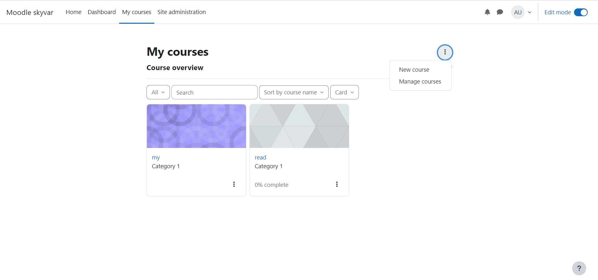
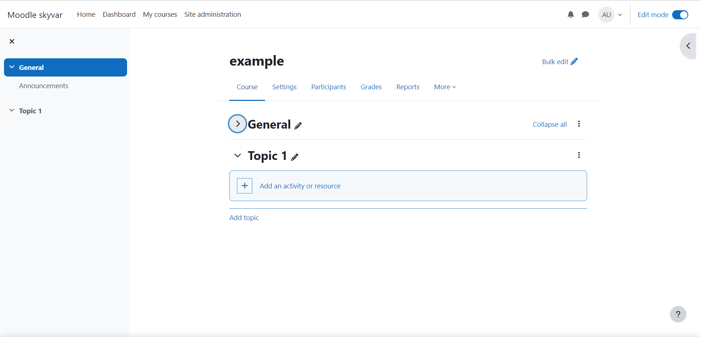
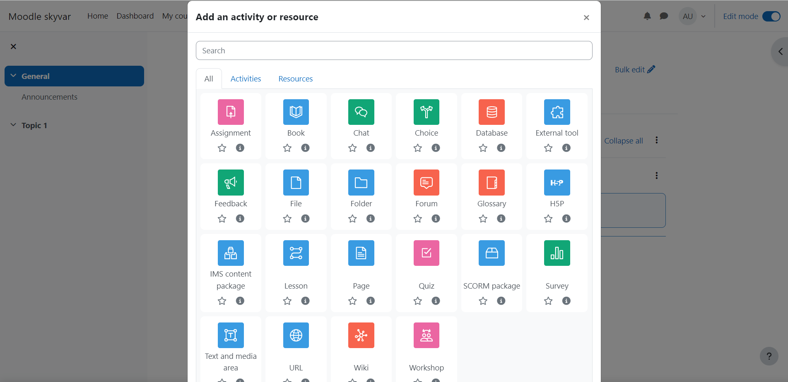
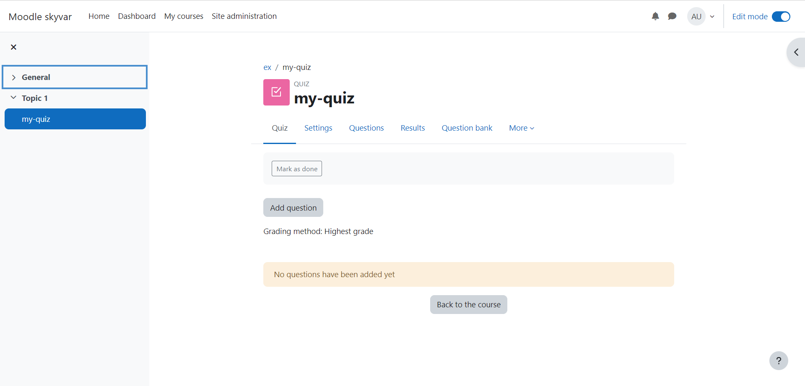
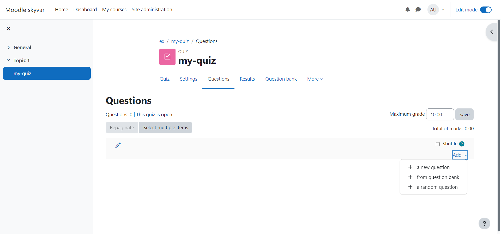
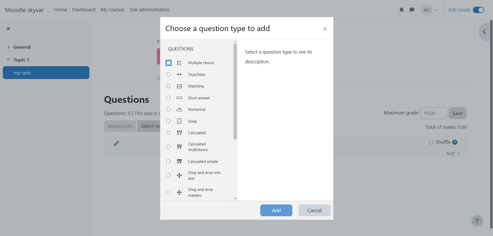

# Create quiz

## Steps in creating a test:

- Create a lesson

- Moving the page to edit mode.

- Click Add Activity and select Quiz.

- In the next step, fill in the quiz .definitions such as the quiz's name, description, passing grade, time limit, and more.
- Click Save and Display

- Click Add Question

- Click Add and select one of the following options:
  - New Question - Creating this question has several question types.
  The question must be edited and answered.
  
  - A question from the question bank.
  - A random question from the existing questions.

[guide for creating a quiz](https://www.ispringsolutions.com/blog/how-to-create-a-moodle-quiz)
